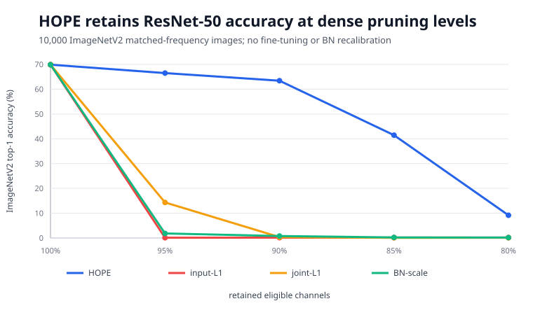
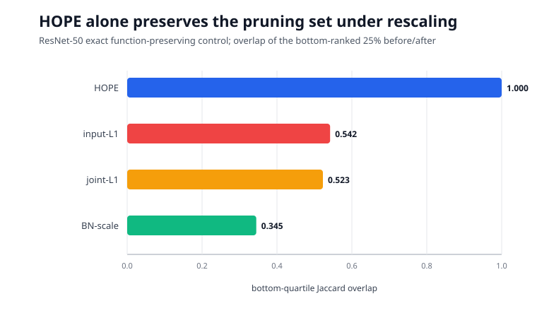
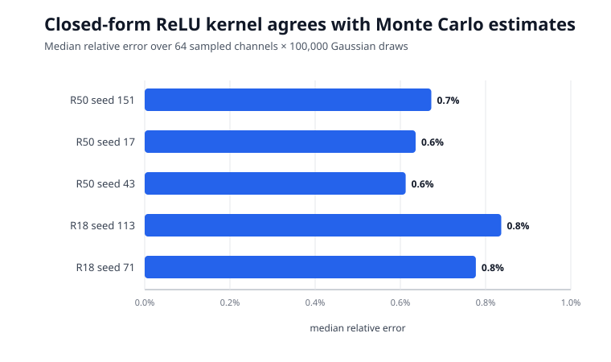
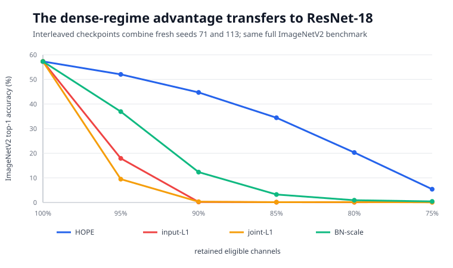

# Does HOPE Find Safer Channels to Prune?

Modern neural networks contain many channels that appear removable, but ordinary weight-size rules can change their answer when the same function is written with differently scaled parameters. HOPE proposes scoring channels by the functions they compute instead of their raw weights. This reproduction tests whether that score is truly unchanged by harmless rescaling and whether its pruning choices protect accuracy better.

**Verdict: partially reproduced.** Both selected claims align strongly on public pretrained BatchNorm ResNets and all 10,000 ImageNetV2 matched-frequency images. Scope differs from the paper: torchvision models and ImageNetV2 replace Keras ResNet-50 and gated ImageNet validation; internal channels are masked without recalibration, fine-tuning, or physical speed measurements.

**How to read it.** Every curve starts from the same 69.90% baseline. At 90% retained channel density, HOPE kept 63.42% top-1 while the best comparator kept 0.78%; at 95%, HOPE kept 66.51% while joint-L1, the strongest comparator there, kept 14.33%. HOPE's absolute accuracy also collapses by 80%, so the result supports a substantially better ordering at dense pruning levels—not recovery-free extreme compression.

## From a neuron to a function-space score

For a BatchNorm channel followed by ReLU, HOPE models its standardized input as Gaussian. If BatchNorm produces \(z=\beta+|\gamma|X\), the paper gives the closed-form squared norm

\[
K=(\gamma^2+\beta^2)\Phi(\beta/|\gamma|)
  +\beta|\gamma|\phi(\beta/|\gamma|),
\]

where \(\Phi\) and \(\phi\) are the normal distribution's cumulative and density functions. We multiply \(\sqrt K\) by the outgoing weight norm for neuron capacity, then apply the paper's distortion-rate normalization by static channel footprint. The code collects only removable internal residual-block channels: Bottleneck conv1/conv2 and BasicBlock conv1. Post-BatchNorm masks are functionally equivalent to deleting each chosen channel and its downstream input slice.

The three comparators are input-filter L1, joint input/output L1, and absolute BatchNorm scale. Every method receives the same model, channels, density, preprocessing, and full validation set; none receives recalibration or fine-tuning.

## Claim 1: invariance under equivalent parameterizations

We sampled independent positive factors roughly from 0.50 to 2.01. One transformation rescales a convolution and cancels it through BatchNorm statistics; another rescales the positive BatchNorm/ReLU output and inversely rescales downstream weights. A float64 nonadjacent ResNet-50 control preserved logits to \(5.65\times10^{-16}\) maximum relative difference.

HOPE's full ranking had Spearman correlation 1.0, exact positional agreement 1.0, and maximum relative score change \(1.90\times10^{-14}\). Its bottom-ranked quartile was identical. Raw scores were not invariant: their corresponding pruning-set overlaps ranged from 0.345 to 0.542. **Assessment: aligned.**

The closed form was also checked directly rather than trusted as an implementation detail:

Each bar summarizes 64 channels and 100,000 Gaussian draws per channel. Across five model/seed conditions, median relative error was 0.61–0.84%; worst individual-channel error was 4.62%. This is consistent with Monte Carlo sampling error and catches indexing or sign mistakes in the analytic implementation.

## Claim 2: accuracy under matched structured pruning

ResNet-50 was evaluated at twelve densities from 100% to 45%. The headline dense checkpoints provide decisive separation:

| Density | HOPE | input-L1 | joint-L1 | BN-scale |
|---:|---:|---:|---:|---:|
| 95% | **66.51** | 0.11 | 14.33 | 1.83 |
| 90% | **63.42** | 0.14 | 0.36 | 0.78 |
| 85% | **41.47** | 0.16 | 0.09 | 0.22 |
| 80% | **9.16** | 0.18 | 0.12 | 0.18 |

The paper presents this result qualitatively in a curve—HOPE above magnitude pruning—but provides no tabulated coordinates, so an exact paper-number comparison is unavailable. Our observed advantage is 62.64 percentage points over the strongest baseline at 90% density.

ResNet-18 gives the same ordering: at 90%, HOPE retained 44.71% from a 57.29% baseline, versus 12.35% for BN-scale and at most 0.31% for L1. Interleaved density checkpoints from a second fresh seed show a smooth decline. Below about 75–80%, all untuned variants become brittle; HOPE remains numerically best but not practically accurate. **Assessment: aligned at dense densities; inconclusive for useful extreme pruning without recovery.**

## Interpretation and limits

The symmetry test explains the pruning result: magnitude methods can select different channels for mathematically equivalent networks, while HOPE selects the same set. That property translated into much safer dense pruning on two architectures.

This is a focused reproduction, not an exact rerun. ImageNetV2 is a public distribution-shifted benchmark; torchvision weights and preprocessing differ from the paper's Keras setup. Masks establish functional accuracy but not latency or memory savings. Residual outputs, downsample paths, post-pruning BatchNorm recalibration, fine-tuning, merging, block eviction, and DEFT were deliberately excluded. A full-scale follow-up needs the authors' exact graph mapping and original ImageNet evaluation protocol.

Fresh evidence ran only after 2026-07-26T02:02:01Z on Kubernetes. Peak allocation was 16 concurrent NVIDIA RTX PRO 6000 Blackwell GPUs (four independent 4-GPU experiments); measured experiment wall span was 0.42 hours. Branch provenance and the exact command are in the [README](../../README.md); exhaustive measurements are in [results.json](results.json) and the self-contained [marimo notebook](../../notebooks/hope_reproduction.py).
